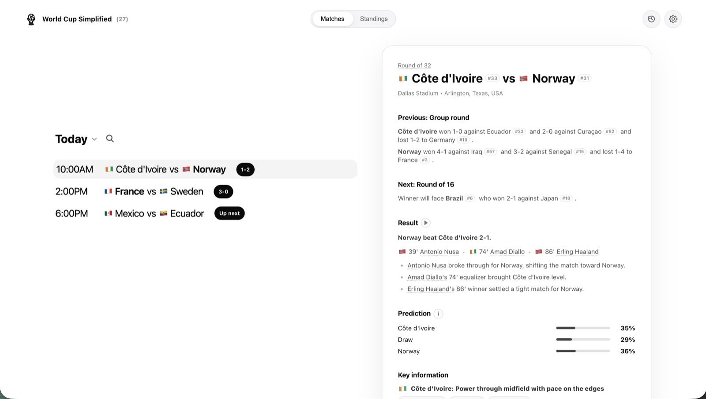
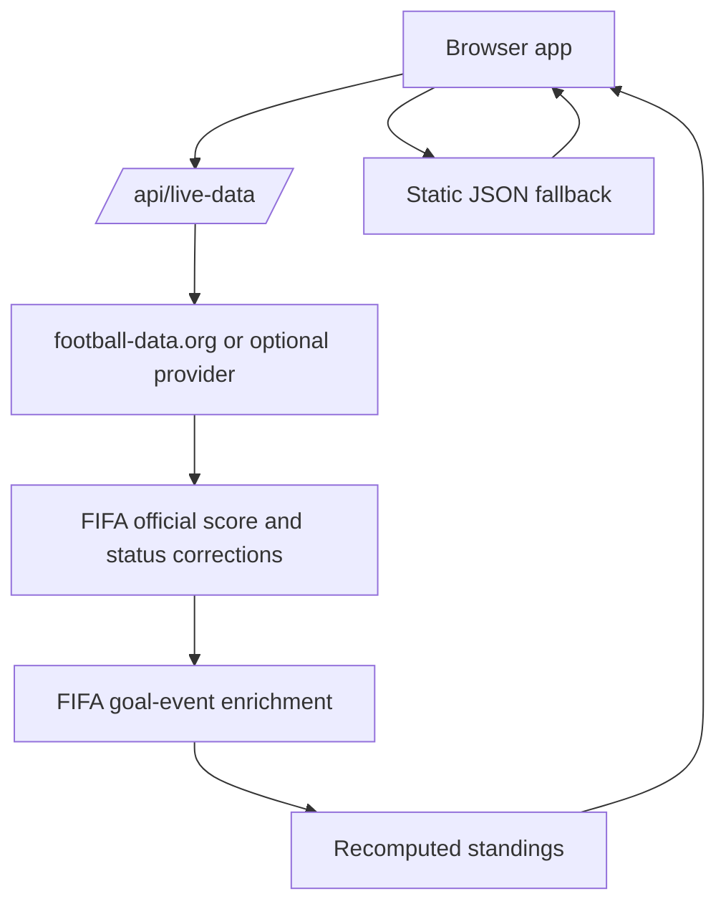

# World Cup Simplified

[](https://github.com/hirooaoy/world-cup-simplified/actions/workflows/data-quality.yml)
[](https://world-cup-simplified.vercel.app)
[](https://pnpm.io/)

A clean, fast World Cup companion for casual fans who want the schedule, standings, team context, and official highlights without tournament clutter.

**Live demo:** <https://world-cup-simplified.vercel.app>



## Features

- Live World Cup schedule with local kickoff times and clear match statuses.
- Group standings, projected knockout paths, and a third-place race tracker.
- Team guides, player cards, matchup notes, and result recaps.
- Qualification probabilities and prediction labels where the data supports them.
- Verified official highlight videos when an official source is available.
- English and Chinese UI with user-selectable time zones.
- Automatic live data updates with a static JSON fallback.

## Quick Start

Use pnpm for reproducible installs:

```sh
pnpm install
pnpm test
```

`pnpm test` validates JSON data, audits matchup/result copy, checks player-card coverage, audits data freshness/status drift, and runs a Playwright smoke test against a local static server.

## Architecture



The app is mostly static: `index.html`, `styles.css`, `app.js`, and JSON files in `data/`. Production tries `/api/live-data` first, then falls back to committed JSON when the live route is unavailable.

## Project Layout

- `index.html`, `styles.css`, `app.js`: the static browser app.
- `data/`: schedules, standings, teams, tournament state, player profiles, release notes, and fallback data.
- `api/live-data.js`: Vercel serverless route for live score/status updates.
- `api/report-issue.js`: report form endpoint powered by Resend.
- `scripts/`: data sync, enrichment, validation, audits, and UI smoke checks.
- `.github/workflows/`: CI and scheduled data automation.

## Development

Run the full local gate before shipping code or data changes:

```sh
pnpm test
```

On match days, refresh the static snapshot first:

```sh
pnpm matchday:update
```

`pnpm matchday:update` runs the score/status sync, goal-event sync, player-profile refresh when validation proves cards are stale, factual result-highlight refresh, official highlight-video sync, and the same verification checks used by `pnpm test`. Current-match story bullets are not generated by this command; add them only after a source-backed post-match research pass.

To prebuild cards before a match, run a targeted squad crawl instead of waiting for a scorer to appear:

```sh
pnpm profiles:country -- --teams=CRO
```

The country workflow preflights squad candidates, blocks unsafe aliases, loads country-specific copy from `data/player-profile-overrides/2026/`, generates only that country's squad cards, merges them into the existing profile file, audits the generated cards, then runs validation/card checks/UI smoke. Use `--skip-smoke` only for a quick local iteration. Matchday auto-repair is narrower: if validation finds broken scorer cards, it refreshes only the named failing profiles.

User-facing app/API/UI changes should update `data/release-notes.json` in the same change. CI runs `pnpm release-notes:check` to catch product changes that forgot release notes; pure fixture/source data refreshes remain covered by the separate data freshness timestamps.

## Deployment

The site is set up for Vercel. Static pages are served from the repo root, `/api/live-data` handles server-side data refreshes, and the `Report issue` flow posts to `/api/report-issue`.

Before launch:

1. Confirm the production origin. The current metadata, `robots.txt`, and `sitemap.xml` use `https://world-cup-simplified.vercel.app/`.
2. Deploy on Vercel so `api/report-issue.js` is available at `/api/report-issue`.
3. Create a Resend API key.
4. Add the environment variables below in Vercel.
5. Use a verified sender/domain for `REPORT_FROM_EMAIL`.
6. Run `pnpm test` before promoting a data update.

## Environment Variables

Keep local `.env` files private. `.env.example` lists the supported keys without real values.

Required for the report endpoint:

```sh
RESEND_API_KEY=
REPORT_TO_EMAIL=
REPORT_FROM_EMAIL=
ALLOWED_REPORT_ORIGINS=https://world-cup-simplified.vercel.app
```

Optional report-endpoint tuning:

```sh
REPORT_RATE_LIMIT_MAX=5
REPORT_RATE_LIMIT_WINDOW_MS=600000
REPORT_MAX_BODY_BYTES=16384
RESEND_TIMEOUT_MS=8000
```

Optional result-story queue tuning:

```sh
RESULT_RESEARCH_LOOKBACK_HOURS=36
```

`pnpm results:research` is intentionally free: it reports finished matches that still need source-backed Result story research, but it does not call paid APIs or write narrative bullets. Use it as the handoff point for an interactive or scheduled Codex research pass; until researched bullets exist, the app keeps showing only factual score/scorer/video data.

Automatic data updates:

```sh
LIVE_DATA_PROVIDER=football-data
LIVE_DATA_CACHE_SECONDS=300
LIVE_DATA_STALE_SECONDS=300
FOOTBALL_DATA_API_KEY=
FOOTBALL_DATA_COMPETITION=WC
FOOTBALL_DATA_SEASON=2026
FOOTBALL_DATA_WINDOW_BEFORE_DAYS=2
FOOTBALL_DATA_WINDOW_AFTER_DAYS=2
FOOTBALL_DATA_TIMEOUT_MS=8000
FIFA_GOAL_EVENTS_ENABLED=true
FIFA_GOAL_EVENTS_TIMEOUT_MS=5000
FIFA_GOAL_EVENTS_MAX_FIXTURES=8
API_FOOTBALL_API_KEY=
API_FOOTBALL_LEAGUE_ID=1
API_FOOTBALL_SEASON=2026
API_FOOTBALL_WINDOW_BEFORE_DAYS=1
API_FOOTBALL_WINDOW_AFTER_DAYS=1
API_FOOTBALL_TIMEOUT_MS=8000
API_FOOTBALL_MAX_PAGES=5
API_FOOTBALL_TIMEZONE=America/Los_Angeles
SPORTMONKS_API_TOKEN=
SPORTMONKS_SEASON_ID=
SPORTMONKS_LEAGUE_ID=
SPORTMONKS_WINDOW_BEFORE_DAYS=1
SPORTMONKS_WINDOW_AFTER_DAYS=1
SPORTMONKS_TIMEOUT_MS=8000
SPORTMONKS_MAX_PAGES=5
SYNC_TIMEZONE=America/Los_Angeles
```

## Automation

The production site tries `/api/live-data` before it falls back to the static JSON files. That API route runs server-side, fetches recent provider fixtures, merges live/final scores into the existing fixtures, applies FIFA official score/status corrections, enriches scored matches with official FIFA goal-event timelines when available, recomputes group standings, and returns a CDN-cached snapshot to the browser. Visitors still get the fast static app, but the data can update automatically without exposing the provider key.

The free/default provider is football-data.org. The site defaults to competition `WC` and season `2026`, and uses the delayed-score free tier so the custom UI can update without exposing the provider key.

Important: `/api/live-data` is the automatic production path. The committed JSON files are the static fallback; they only change when `pnpm sync:fifa` is run and the resulting data is committed/deployed. The scheduled Data Quality workflow checks a synced snapshot, but it does not publish fallback JSON by itself.

To enable the free football-data.org sync:

1. Create a football-data.org account.
2. Add `FOOTBALL_DATA_API_KEY` in Vercel.
3. Keep `FOOTBALL_DATA_COMPETITION=WC` and `FOOTBALL_DATA_SEASON=2026` unless football-data.org changes their World Cup mapping.
4. Optionally copy `data/provider-map.example.json` to `data/provider-map.json` and fill in provider IDs if name matching is not enough.
5. Deploy. The site will use live provider data automatically when `/api/live-data` succeeds, and static JSON when it does not.

The live endpoint is cached for 5 minutes by default with football-data.org. You can override that with `LIVE_DATA_CACHE_SECONDS` and `LIVE_DATA_STALE_SECONDS`; use higher values if you want fewer provider calls. Even when football-data.org, API-Football, or Sportmonks is the configured provider, FIFA's public match calendar is applied afterward so official score reversals win before scorer enrichment runs. Goal-scorer enrichment uses FIFA's public match timeline only for scored live/final fixtures whose `goalsHome` / `goalsAway` arrays are missing or incomplete. Set `FIFA_GOAL_EVENTS_ENABLED=false` to disable it, or lower `FIFA_GOAL_EVENTS_MAX_FIXTURES` if the endpoint ever needs stricter request bounds.

API-Football and Sportmonks remain supported as optional providers. Set `LIVE_DATA_PROVIDER=api-football` or `LIVE_DATA_PROVIDER=sportmonks` and add the matching token plus optional league/season IDs.

The GitHub Data Quality workflow runs the same FIFA score, goal-event, and factual result-highlight refreshes before testing, so scheduled CI validates an official results snapshot instead of failing only because committed fallback JSON is a few matches behind.

The static fallback can also update itself through GitHub. The `Sync FIFA Results Hybrid` workflow runs every 30 minutes during the 2026 tournament window. It first runs `pnpm sync:fifa:pr`, validates and audits the official score/status/standings snapshot, then commits `data/fixtures.json`, `data/standings.json`, and `data/tournament.json` directly to `main` when those official fallback files change. After that, it runs `pnpm sync:fifa:goals`, `pnpm results`, `pnpm sync:youtube`, `pnpm results:research`, and profile-aware validation; scorer events, factual result-highlight copy, official highlight-video dispositions, result-story research needs, and player-card/profile changes still open or update the review PR on `codex/fifa-results-sync`. Current-match story bullets stay out of that automatic path unless a source-backed research pass writes them. In GitHub, make sure **Settings -> Actions -> General -> Workflow permissions** allows read/write access so the workflow can push `main` and create the PR. If you want bot pushes to trigger every downstream workflow, add a fine-scoped `SYNC_PR_TOKEN` repository secret; otherwise the default `GITHUB_TOKEN` is enough for the hybrid sync workflow itself.

## Contributing

Before opening a PR:

1. Run `pnpm test`.
2. Update `data/release-notes.json` for user-facing app/API/UI changes.
3. Keep provider keys and local `.env` files out of git.
4. Prefer verified official data and highlight sources over fast but uncertain enrichment.
