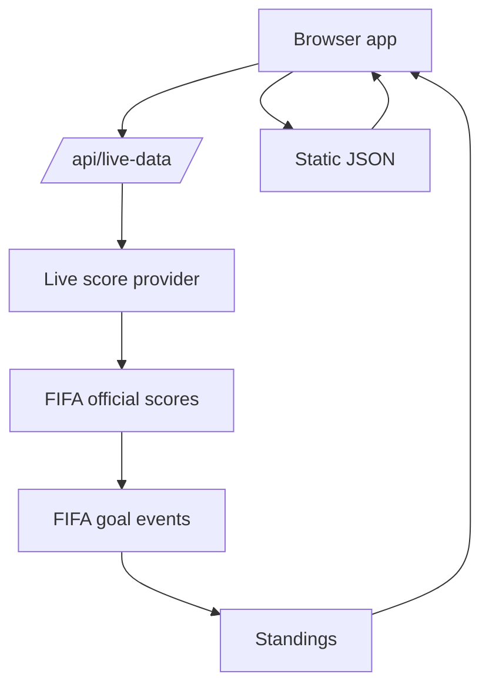

# World Cup Simplified

[](https://github.com/hirooaoy/world-cup-simplified/actions/workflows/data-quality.yml)
[](https://world-cup-simplified.vercel.app)
[](https://pnpm.io/)

The simplest way to follow the FIFA World Cup.

It puts the schedule, standings, team guides, predictions, results, and official highlights in one place.

**Live demo:** <https://world-cup-simplified.vercel.app>


## What You Can Do

- Find every match, with kickoff times in your time zone.
- See what is live, final, or coming up next.
- Follow groups, knockout paths, and the third-place race.
- Learn about every team before they play.
- Know the key players on each squad.
- See what matters in each matchup.
- See match predictions and qualification chances when there is enough data.
- Watch official highlights after FIFA publishes them.
- Use the app in English or Chinese.

## Quick Start

Install dependencies and run the checks:

```sh
pnpm install
pnpm test
```

`pnpm test` validates the data, checks match and result writing, audits player-card coverage, checks freshness, and runs a Playwright smoke test.

## How It Works



Most of the site is static. The browser loads the app from `index.html`, `styles.css`, `app.js`, and the JSON files in `data/`.

In production, the app tries `/api/live-data` first. If that route is unavailable, it uses the committed JSON files instead.

## Project Layout

- `index.html`, `styles.css`, `app.js`: the browser app.
- `data/`: matches, standings, teams, player profiles, tournament data, release notes, and fallback data.
- `api/live-data.js`: live score and status updates for Vercel.
- `api/report-issue.js`: the report form endpoint.
- `scripts/`: sync, enrichment, validation, audits, and browser smoke checks.
- `.github/workflows/`: CI and scheduled data jobs.

## Development

Run the full local gate before shipping code or data changes:

```sh
pnpm test
```

On match days, refresh the static snapshot first:

```sh
pnpm matchday:update
```

`pnpm matchday:update` refreshes scores, status, goal events, player cards when needed, result facts, and official highlight links. It also runs the same checks as `pnpm test`.

The command does not write current-match story bullets. Add those only after a source-backed post-match research pass.

Use `pnpm results:research` to find finished matches that still need sourced story bullets. It reports what needs work. It does not call paid APIs or write prose.

To build cards for one team before a match, run:

```sh
pnpm profiles:country -- --teams=CRO
```

That workflow builds only the selected squad cards, merges them into the existing profile file, and runs the card checks. Use `--skip-smoke` only for a quick local pass.

Update `data/release-notes.json` when a user-facing app, API, or UI change ships. CI runs `pnpm release-notes:check` for that.

## Deployment

The site is set up for Vercel. Static pages are served from the repo root. `/api/live-data` refreshes match data. `/api/report-issue` handles the report form.

Before launch:

1. Confirm the production origin. The current metadata, `robots.txt`, and `sitemap.xml` use `https://world-cup-simplified.vercel.app/`.
2. Deploy on Vercel so the API routes are available.
3. Create a Resend API key.
4. Add the environment variables below in Vercel.
5. Use a verified sender or domain for `REPORT_FROM_EMAIL`.
6. Run `pnpm test` before promoting a data update.

## Environment Variables

Keep local `.env` files private. `.env.example` lists the supported keys without real values.

Required for the report form:

```sh
RESEND_API_KEY=
REPORT_TO_EMAIL=
REPORT_FROM_EMAIL=
ALLOWED_REPORT_ORIGINS=https://world-cup-simplified.vercel.app
```

Optional report-form tuning:

```sh
REPORT_RATE_LIMIT_MAX=5
REPORT_RATE_LIMIT_WINDOW_MS=600000
REPORT_MAX_BODY_BYTES=16384
RESEND_TIMEOUT_MS=8000
```

Optional result-story queue tuning:

```sh
RESULT_RESEARCH_LOOKBACK_HOURS=36
```

Automatic data updates:

```sh
LIVE_DATA_PROVIDER=football-data
LIVE_DATA_CACHE_SECONDS=300
LIVE_DATA_STALE_SECONDS=300
FOOTBALL_DATA_API_KEY=
FOOTBALL_DATA_COMPETITION=WC
FOOTBALL_DATA_SEASON=2026
FOOTBALL_DATA_WINDOW_BEFORE_DAYS=2
FOOTBALL_DATA_WINDOW_AFTER_DAYS=2
FOOTBALL_DATA_TIMEOUT_MS=8000
FIFA_FALLBACK_TIMEOUT_MS=2000
FIFA_GOAL_EVENTS_ENABLED=true
FIFA_GOAL_EVENTS_TIMEOUT_MS=5000
FIFA_GOAL_EVENTS_MAX_FIXTURES=8
API_FOOTBALL_API_KEY=
API_FOOTBALL_LEAGUE_ID=1
API_FOOTBALL_SEASON=2026
API_FOOTBALL_WINDOW_BEFORE_DAYS=1
API_FOOTBALL_WINDOW_AFTER_DAYS=1
API_FOOTBALL_TIMEOUT_MS=8000
API_FOOTBALL_MAX_PAGES=5
API_FOOTBALL_TIMEZONE=America/Los_Angeles
SPORTMONKS_API_TOKEN=
SPORTMONKS_SEASON_ID=
SPORTMONKS_LEAGUE_ID=
SPORTMONKS_WINDOW_BEFORE_DAYS=1
SPORTMONKS_WINDOW_AFTER_DAYS=1
SPORTMONKS_TIMEOUT_MS=8000
SPORTMONKS_MAX_PAGES=5
SYNC_TIMEZONE=America/Los_Angeles
```

## Data Updates

Production tries `/api/live-data` before it uses static JSON. The route fetches recent provider matches, applies FIFA score and status corrections, adds FIFA goal events when they are available, recomputes standings, and returns a cached snapshot.

The default provider is football-data.org. The site defaults to competition `WC` and season `2026`.

To enable football-data.org:

1. Create a football-data.org account.
2. Add `FOOTBALL_DATA_API_KEY` in Vercel.
3. Keep `FOOTBALL_DATA_COMPETITION=WC` and `FOOTBALL_DATA_SEASON=2026` unless football-data.org changes its World Cup mapping.
4. Optionally copy `data/provider-map.example.json` to `data/provider-map.json` and add provider IDs if name matching is not enough.
5. Deploy.

The live endpoint is cached for 5 minutes by default. Change `LIVE_DATA_CACHE_SECONDS` and `LIVE_DATA_STALE_SECONDS` if you need fewer provider calls. Failed fallback responses use `no-store`; when the main sync times out, the API first tries a fast FIFA official score fallback controlled by `FIFA_FALLBACK_TIMEOUT_MS`.

API-Football and Sportmonks are also supported. Set `LIVE_DATA_PROVIDER=api-football` or `LIVE_DATA_PROVIDER=sportmonks`, then add the matching token and optional league or season IDs.

The GitHub Data Quality workflow validates an official results snapshot before testing.

The `Sync FIFA Results Hybrid` workflow runs every 30 minutes during the 2026 tournament window. It can commit official fallback files to `main` when scores, statuses, or standings change. Richer updates, such as player cards, highlight dispositions, and research needs, open or update the review PR on `codex/fifa-results-sync`.

In GitHub, make sure **Settings -> Actions -> General -> Workflow permissions** allows read/write access. Add a fine-scoped `SYNC_PR_TOKEN` repository secret if bot pushes need to trigger downstream workflows.

## Contributing

Before opening a PR:

1. Run `pnpm test`.
2. Update `data/release-notes.json` for user-facing app, API, or UI changes.
3. Keep provider keys and local `.env` files out of git.
4. Use verified official data and highlight sources whenever possible.
