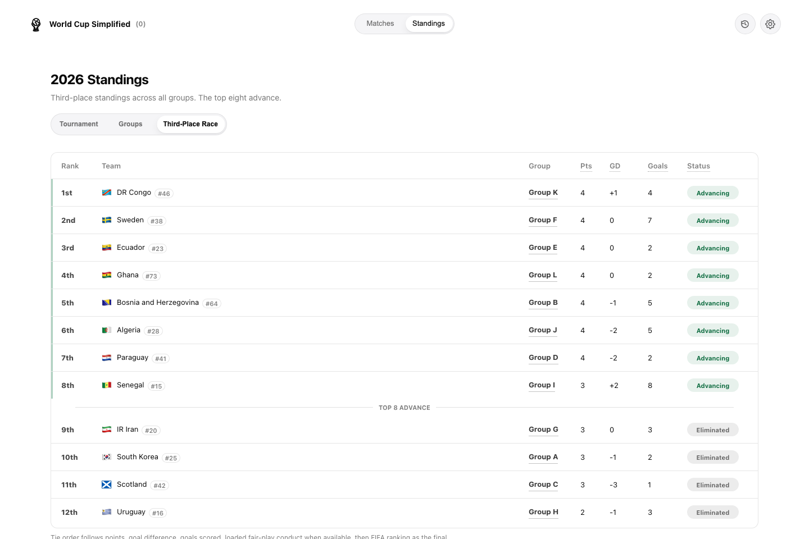

# World Cup Simplified

[](https://github.com/hirooaoy/world-cup-simplified/actions/workflows/data-quality.yml)
[](https://world-cup-simplified.vercel.app)
[](https://pnpm.io/)

A historical archive of the 2026 FIFA World Cup, with fixtures, results,
standings, team and player profiles, forecasts, and official highlights.

**Live archive:** <https://world-cup-simplified.vercel.app>

> The 2026 tournament has ended. The site now uses its final archived data.
> Live-data tools remain in the repository for maintenance and future editions.



## Features

- Fixtures and results with kickoff times in the visitor's time zone
- Group standings and the complete knockout bracket
- Team, coach, and player profiles
- Pre-match forecasts preserved for historical context
- Official highlight links
- English, Chinese, Spanish, and Korean support

## Run Locally

Install dependencies and run the checks:

```sh
pnpm install
pnpm test
```

The frontend is a static browser application. Serve the repository root with a
local HTTP server, for example:

```sh
python3 -m http.server 4173
```

Then open <http://localhost:4173>.

## How It Works

The main application is loaded from `index.html`, `styles.css`, `app.js`, and
JSON files in `data/`. Historical information and player profiles load after
the main match data so they do not block the first useful screen.

The app reads `data/edition-lifecycle.json` before choosing a data source.
Archived editions use committed JSON without polling a live provider. During an
active tournament window, the app can request `/api/live-data` and fall back to
the committed data if needed.

## Project Structure

- `api/`: live-data and report-form endpoints
- `assets/`: images and other static assets
- `data/`: fixtures, standings, profiles, tournament data, and release notes
- `docs/`: project and release documentation
- `locales/`: translated content
- `scripts/`: data sync, enrichment, validation, and audit tools
- `.github/workflows/`: CI and guarded maintenance workflows

## Useful Commands

Inspect the repository, CI, deployment, and production state:

```sh
pnpm release:status
```

List or run focused browser checks:

```sh
pnpm smoke:group -- --list
pnpm smoke:group -- --group=ball-boy
pnpm smoke:shard -- --shard=2/3
```

Find completed matches that are missing sourced result notes:

```sh
pnpm results:research
```

The matchday update tools remain available for maintenance and future editions:

```sh
pnpm matchday:update
pnpm matchday:update:verify
```

The second command forces the complete verification pass.

## Data Sources and Configuration

The live endpoint supports football-data.org, API-Football, Sportmonks, and
FIFA fallbacks for scores, match status, and goal events. The archived site does
not need provider credentials unless its live-data path is being maintained.

See [`.env.example`](.env.example) for common configuration. The report form
requires a Resend API key, destination address, verified sender, and allowed
origin. Keep API keys and local `.env` files out of Git.

## Deployment

The production site is hosted on Vercel. Pushes to `main` create the production
deployment automatically, so a separate `vercel --prod` command is not needed
for a normal release.

Static pages are served from the repository root. `/api/live-data` provides
live match data when enabled, and `/api/report-issue` handles report-form
submissions.

The internal publishing and recovery process is documented in
[`docs/codex-operating-manual.md`](docs/codex-operating-manual.md).

## Contributing

- Run checks related to the files you changed
- Run `pnpm test` for large or cross-cutting changes
- Use reliable, preferably official, sources for factual data
- Do not commit provider keys or local environment files
- Update `data/release-notes.json` only for meaningful user-facing changes
